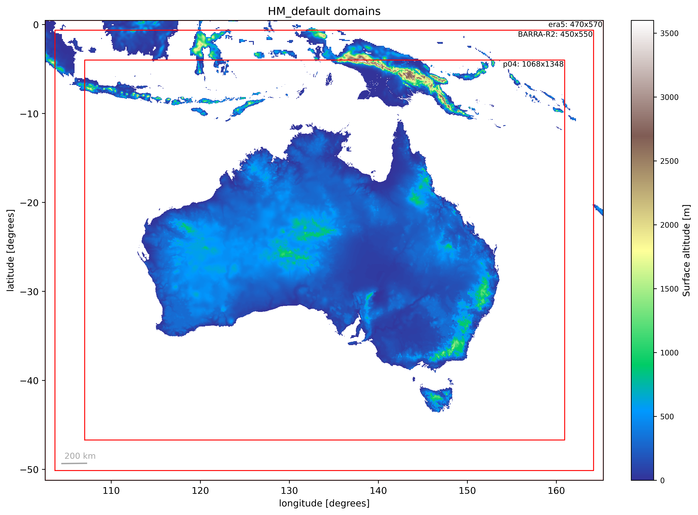

# Ancillary generation

These ancillaries are based on the BARPA-C domain grid proved by Siyuan here: `/g/data/ce10/CoupledExp/BARPA-C_ancil/AUST04_CCIv1`.

Two additional outer domains are required for ACCESS-rAM: 

- the 0.11 degree ERA5 driving model domain, and
- the 0.11 degree parent domain (using initial land conditions from BARRA-R2).

To create these ancillaries:

1. Get the ACCESS-rAM3 ancillary generation suite `u-bu503/nci_access_ram3`
2. Download the HM-AU optional config file [`rose-suite-HM-AU_default.conf`](rose-suite-HM-AU_default.conf) and place in `~/roses/u-bu503/opt` folder
3. Run with: `rose suite-run -O HM-AU_default --name=ancils_HM-AU_default`

# Result

These plots use [plot_domains.py](plot_domains.py).

